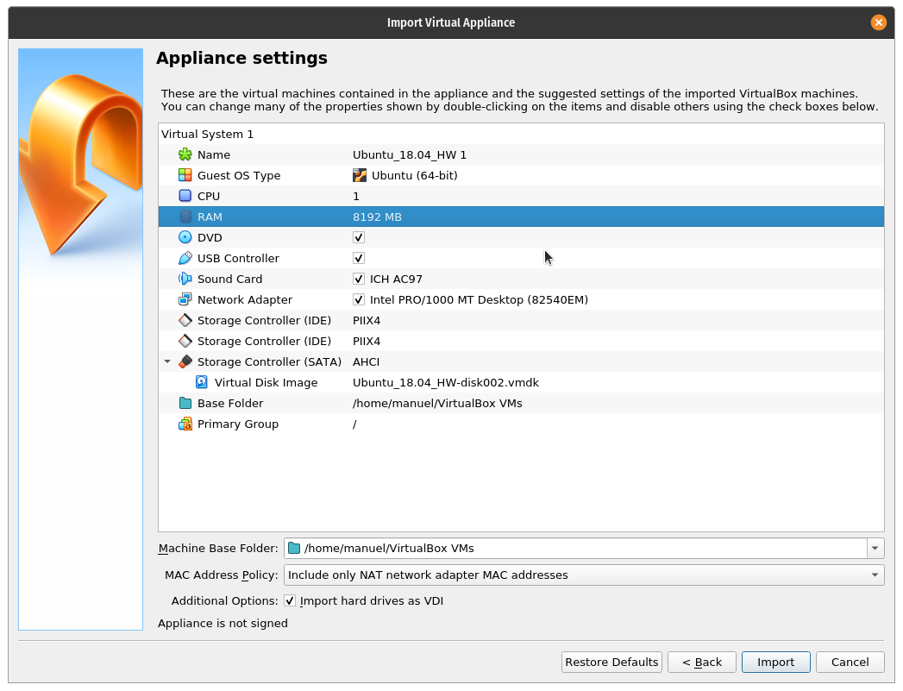
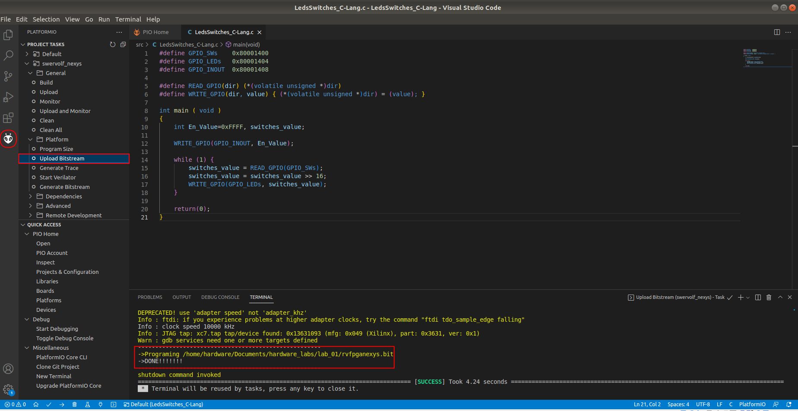

# Laboratory #1

In this laboratory you will get familiar with the following:

* Virtual Machine

* Linux Terminal

* Nexys 4 DDR development board

* Xilinx Vivado 2019.2

* Visual Studio Code

* PlatformIO

## Install the Virtual Machine

First download the OVA image for the course from here

Now open VirtualBox and select `File` > `Import Appliance...`

A window will open, be sure to set `Source` to `Local File System` and `File` to your `Ubuntu_18.04_HW.ova` file. Then click `Next`.


In the Appliance Settings, the default `RAM` is set to 8GB, but depending your hardware specs, you might need to lower it. It is recommended to set it to at least 4GB of memory.

Set the `Machine Base Folder` to a location where you have enough space to store the VirtualBox image. When done, click on `Import`.



The loading proces will take a few minutes.


When done, a new machine called `Ubuntu_18.04_HW` will be created. Select it and press `Start`.


This will start a virtual machine with Ubuntu 18.04. The user name is `hardware` and the password is `qwerty`.


## Download Vivado Lab Files

Inside the Virtual Machine, click on `Show Applications` in the lower left corner of the Ubuntu Desktop.


This will prompt all the current applications. In the searching bar type `terminal` and click on it to open the Terminal.


The terminal will look as follows, in here you will be able to write some commands.


Write the following commands (in order) to create the working path for this laboratory

```bash
# Create working path
# ~/Documents/hardware_labs/lab_01
cd ~/Documents/

mkdir hardware_labs

cd hardware_labs/

mkdir lab_01

cd lab_01/
```

Then, in the Terminal, load the `hw_env` environment variable by typing

```bash
conda activate hw_env
```

Create the following script to download the required files for this laboratory

```bash
# Create download_vivado_demo_mediafire.py script
touch download_vivado_demo_mediafire.py

echo 'from mediafiredl import MediafireDL as MF' > download_vivado_demo_mediafire.py 
echo 'url = "https://www.mediafire.com/file/ht6topj10cuqxl4/demo.bit/file"' >> download_vivado_demo_mediafire.py 
echo 'file_result = MF.Download(url, output="/home/hardware/Documents/hardware_labs/lab_01")' >> download_vivado_demo_mediafire.py
```

Run the newly created script to download the `test.bit` bitfile

```bash
python download_vivado_demo_mediafire.py
```

## Run Vivado

In the Terminal write

```bash
cd ~
vivado
```

This will open Vivado 2019.2 software from Xilinx, which will be our main tool for simulation, synthesis and implementation of our designs.


In this part, we will program our FPGA with the `test.bit` file downloaded before. To do so,  select `Task`> `Open Hardware Manager`


A new window will open as shown in the image below. Click on `Open Target`> `Auto Connect`


Although you tried to connect to the development board, the Virtual Machine cannot see the USB port. In order to fix this issue, you need to select on VirtualBox: `Devices` > `USB` > `Digilent USB Device`


Now, try again clicking on `Open Target`> `Auto Connect`

If everything is fixed now, you will be able to see the option: `Program device`. Click on it.


Set the `Bitstream file:` to the location of `demo.bit` and click on `Program`.


Now pull the switches and press the push buttoms from the development card and see the results.

## Download Visual Studio Lab Files

Opent a new Terminal and type

```bash
# Activate conda environment
conda activate hw_env

# Move to lab_01 path
cd /home/hardware/Documents/hardware_labs/lab_01

# Create download_visual_demo_mediafire.py script
touch download_visual_demo_mediafire.py

echo 'from mediafiredl import MediafireDL as MF' > download_visual_demo_mediafire.py 
echo 'url = "https://www.mediafire.com/file/p5aq5e2u35v9cs7/risc_example.zip/file"' >> download_visual_demo_mediafire.py 
echo 'file_result = MF.Download(url, output="/home/hardware/Documents/hardware_labs/lab_01")' >> download_visual_demo_mediafire.py

# Run download script
python download_visual_demo_mediafire.py

# Unzip the downloaded file
unzip risc_example.zip

# Remove temporary ZIP file
rm risc_example.zip
```

This will download and extract the required files for this excersise.

## Run Visual Studio Code

In the Terminal run the following code to open Visual Studio Code

```bash
# Open Visual Studio Code
code &
```

This version of Visual Studio Code (VSC) includes the PlatformIO IDE which is a platform for developing embedded code on different devices. This will allow us to develop code in C and assembly language into our RISC-V processor.

Inside VSC, in the `Get Started` tab there is a menu called `Start`. Click on `Open Folder...`


Go to the `/home/hardware/Documents/hardware_labs/lab_01` path and select the `LedsSwitches_C-Lang` folder, and then click on `Open`


After loading the project, you will se a window similar as the one depicted below. This shows the `platformio.ini` file which sets the different environment variables for our project. In this case, there is a variable called `board_build.bitstream_file` which sets the location of the board bitfile to be used. In our case, we will use the `rvfpganexys.bit` bitfile that contains the RISC-V architecture.


Now go to the `Explorer` menu on the left side and click on `src` > `LedsSwitches_C-Lang.c` and you will access the source code for this project. Don't worry about understanding the code at this time.

Now we will upload the bitstream to our development board. Go to the left panel and click on `PlatformIO` and in `PROJECT TASKS` click on `Upload Bitstream` (be sure to have your development board connected).



If everythong works well you will see a message that indicates success

```bash
->Programing /home/hardware/Documents/hardware_labs/lab_01/rvfpganexys.bit 
->DONE!!!!!!!
```

On the left panel, click on `Run and Debug`. Then click on  `Start Debugging` (green play button).


This will open the Debugging interface


To control your debugging session, you can use the debugging toolbar which appears near the top of the editor.


You can try to understand what this code does by doing a step by step debug using the development board switches.


# 
