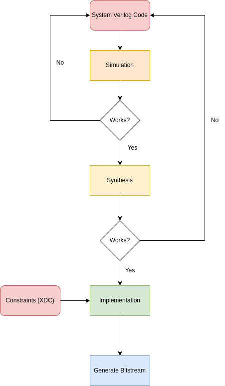

# Laboratory #2

In this laboratory you will get familiar with the following:

* Combinational Logic

* System Verilog

* Nexys 4 DDR development board

* Xilinx Vivado 2019.2

## Developing FPGA designs

A **field-programmable gate array** (**FPGA**) is an [integrated circuit](https://en.wikipedia.org/wiki/Integrated_circuit "Integrated circuit") designed to be configured by a customer or a designer after manufacturing – hence the term [field-programmable](https://en.wikipedia.org/wiki/Field-programmability "Field-programmability"). The FPGA configuration is generally specified using a [hardware description language](https://en.wikipedia.org/wiki/Hardware_description_language "Hardware description language") (HDL), similar to that used for an [application-specific integrated circuit](https://en.wikipedia.org/wiki/Application-Specific_Integrated_Circuit "Application-Specific Integrated Circuit") (ASIC).

The following image depicts the design flow for programming an FPGA



**Simulation** is the process of verifying the functional characteristics of models at any level of abstraction.

**Synthesis** is the process in which we take Verilog or VHDL code, target technology, and constraints as input and map to target technology primitives. 

**Implementation** is the process where we take the synthesis output and place and route   into the actual hardware. Clock tree synthesis and reset is routed.

## Combinational Logic

In the following laboratory we will implement different combinational logic modules using SystemVerilog.

The basic syntax to create a module is as follows:

```verilog
module module_name(
    input logic [M:N] input_a,
    input logic input_b,
    output logic [M:N] output_a,
    output logic output_b
    );

// Some logic here
endmodule
```

Here, `input logic [M:N] input_a` defines an input vector named `input_a` of size `M-N`.  A single input named `input_b` is created with `input logic input_b`. Outputs are defined using `output` instead of `input`.

All modules in SystemVerilog (and Verilog) begin with a `module` and end with an `endmodule` clause. The `module_name` is a descriptive name for our module.

When defining a combinational logic element we use the `assign` statement

```verilog
assign out = in
```

The following table describes the logical operations when using combinational logic

| operation | bit wise | reduction |
|:---------:|:--------:|:---------:|
| INV       | ~        | ~         |
| AND       | &        | &&        |
| OR        | \|       | \|\|      |
| XOR       | ^        | ^^        |

## Exercise #1

Implement a combinational logic module that performs the following operations on  the 8 bits input vectors `in_a` and `in_b`.

* AND

* OR

* NAND

* NOR

* XOR

* XNOR

```verilog
// Exercise #1
// Implement all logic gates
module gates(
    input logic [7:0] in_a,
    input logic [7:0] in_b,
    output logic [7:0] out_1,
    output logic [7:0] out_2,
    output logic [7:0] out_3,
    output logic [7:0] out_4,
    output logic [7:0] out_5,
    output logic [7:0] out_6

    );

    assign out_1 = in_a & in_b;     // AND
    assign out_2 = in_a | in_b;     // OR
    assign out_3 = ~(in_a & in_b);  // NAND
    assign out_4 = ~(in_a | in_b);  // NOR
    assign out_5 = in_a ^ in_b;     // XOR
    assign out_6 = ~(in_a ^ in_b);  // XNOR
endmodule
```

## Exercise #2

Implement a combinational logic module that performs the same operations as Exercise 1 using reduction gates.

```verilog
// Exercise #2
// Implement reduction gates
module reduction_gates(
    input logic [7:0] in_a,
    input logic [7:0] in_b,
    output logic out_1,
    output logic out_2,
    output logic out_3,
    output logic out_4,
    output logic out_5,
    output logic out_6

    );

    assign out_1 = in_a && in_b;     // AND
    assign out_2 = in_a || in_b;     // OR
    assign out_3 = ~(in_a && in_b);  // NAND
    assign out_4 = ~(in_a || in_b);  // NOR
    assign out_5 = in_a ^^ in_b;     // XOR
    assign out_6 = ~(in_a ^^ in_b);  // XNOR
endmodule
```

## Exercise #3

Create a combinational logic module that takes two 8-bits input vectors and selects between each one using a conditional assignment statement.

```verilog
// Exercise #3
// Implement conditional assignment
module conditional_gate(
    input logic [7:0] in_a,
    input logic [7:0] in_b,
    input logic sel,
    output logic [7:0] out
        );

    // if sel==1
    //    out = in_a
    // else
    //    out = in_b     
    assign out = sel ? in_a : in_b;
endmodule
```

## Exercise #4

Create a 4 by 1 multiplexer with 8-bit input and output vectors.

```verilog
// Exercise #4
// Create a multiplexer 4:1
module multiplexer_4_1(
    input logic [7:0] in_a,
    input logic [7:0] in_b,
    input logic [7:0] in_c,
    input logic [7:0] in_d,
    input logic [1:0] sel,
    output logic [7:0] out
    );

    logic [7:0] mux_out_1;
    logic [7:0] mux_out_2;

    // sel == 00     out = in_a
    // sel == 01     out = in_b
    // sel == 10     out = in_c
    // sel == 11     out = in_d 
    assign mux_out_1 = sel[0] ? in_b : in_a;
    assign mux_out_2 = sel[0] ? in_d : in_c;
    assign out = sel[1] ? mux_out_2 : mux_out_1;


endmodule
```

## Exercise #5

Create a combinational logic module that takes as input two 8-bit vectors and returns  the following outputs depending on the value of the input vector `sel`. Implement this module into the FPGA.

| sel | operation |
|:---:|:---------:|
| 00  | AND       |
| 01  | OR        |
| 10  | NAND      |
| 11  | NOR       |

```verilog
// Exercise #5
// Implement 4 logical operations and output one by using a multiplexer
module logical_operations(
    input logic [7:0] in_a,
    input logic [7:0] in_b,
    input logic [1:0] sel,
    output logic [7:0] out
    );

    logic [7:0] out_1_to_in_a;
    logic [7:0] out_2_to_in_b;
    logic [7:0] out_3_to_in_c;
    logic [7:0] out_4_to_in_d;

 gates gates_instance(
    .in_a(in_a),
    .in_b(in_b),
    .out_1(out_1_to_in_a),
    .out_2(out_2_to_in_b),
    .out_3(out_3_to_in_c),
    .out_4(out_4_to_in_d),
    .out_5(),
    .out_6()
    );

 multiplexer_4_1 multiplexer_4_1_instance(
    .in_a(out_1_to_in_a),
    .in_b(out_2_to_in_b),
    .in_c(out_3_to_in_c),
    .in_d(out_4_to_in_d),
    .sel(sel),
    .out(out)
    );


endmodule
```

## XDC File for Nexys 4 DDR

An XDC file is a constraint file that defines the pinout of the FPGA. The following code provides the configuration needed to deploy Exercise #5.

```tcl
# XDC File for Nexys 4 DDR
##Switches
set_property -dict { PACKAGE_PIN J15   IOSTANDARD LVCMOS33 } [get_ports { in_a[0] }];
set_property -dict { PACKAGE_PIN L16   IOSTANDARD LVCMOS33 } [get_ports { in_a[1] }];
set_property -dict { PACKAGE_PIN M13   IOSTANDARD LVCMOS33 } [get_ports { in_a[2] }];
set_property -dict { PACKAGE_PIN R15   IOSTANDARD LVCMOS33 } [get_ports { in_a[3] }];
set_property -dict { PACKAGE_PIN R17   IOSTANDARD LVCMOS33 } [get_ports { in_a[4] }];
set_property -dict { PACKAGE_PIN T18   IOSTANDARD LVCMOS33 } [get_ports { in_a[5] }];
set_property -dict { PACKAGE_PIN U18   IOSTANDARD LVCMOS33 } [get_ports { in_a[6] }];
set_property -dict { PACKAGE_PIN R13   IOSTANDARD LVCMOS33 } [get_ports { in_a[7] }];
set_property -dict { PACKAGE_PIN T8    IOSTANDARD LVCMOS18 } [get_ports { in_b[0] }];
set_property -dict { PACKAGE_PIN U8    IOSTANDARD LVCMOS18 } [get_ports { in_b[1] }];
set_property -dict { PACKAGE_PIN R16   IOSTANDARD LVCMOS33 } [get_ports { in_b[2] }];
set_property -dict { PACKAGE_PIN T13   IOSTANDARD LVCMOS33 } [get_ports { in_b[3] }];
set_property -dict { PACKAGE_PIN H6    IOSTANDARD LVCMOS33 } [get_ports { in_b[4] }];
set_property -dict { PACKAGE_PIN U12   IOSTANDARD LVCMOS33 } [get_ports { in_b[5] }];
set_property -dict { PACKAGE_PIN U11   IOSTANDARD LVCMOS33 } [get_ports { in_b[6] }];
set_property -dict { PACKAGE_PIN V10   IOSTANDARD LVCMOS33 } [get_ports { in_b[7] }];


## LEDs
set_property -dict { PACKAGE_PIN H17   IOSTANDARD LVCMOS33 } [get_ports { out[0] }];
set_property -dict { PACKAGE_PIN K15   IOSTANDARD LVCMOS33 } [get_ports { out[1] }];
set_property -dict { PACKAGE_PIN J13   IOSTANDARD LVCMOS33 } [get_ports { out[2] }];
set_property -dict { PACKAGE_PIN N14   IOSTANDARD LVCMOS33 } [get_ports { out[3] }];
set_property -dict { PACKAGE_PIN R18   IOSTANDARD LVCMOS33 } [get_ports { out[4] }];
set_property -dict { PACKAGE_PIN V17   IOSTANDARD LVCMOS33 } [get_ports { out[5] }];
set_property -dict { PACKAGE_PIN U17   IOSTANDARD LVCMOS33 } [get_ports { out[6] }];
set_property -dict { PACKAGE_PIN U16   IOSTANDARD LVCMOS33 } [get_ports { out[7] }];

##Buttons
set_property -dict { PACKAGE_PIN P17   IOSTANDARD LVCMOS33 } [get_ports { sel[1] }]; #left button
set_property -dict { PACKAGE_PIN M17   IOSTANDARD LVCMOS33 } [get_ports { sel[0] }]; #right button
```
