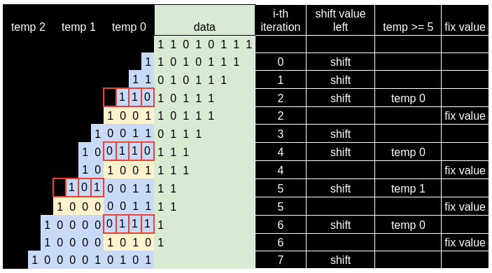

# Laboratory #3

In this laboratory you will get familiar with the following:

* Combinational Logic using `always_comb` statement

* System Verilog

* Nexys 4 DDR/ Nexys A7 development board and the 7 digit display

* Xilinx Vivado 2019.2

## Combinational Logic

In this laboratory we will use the `always_comb` statement. This statement is useful when you need to write multiple lines of combinational logic, or when you need to use `if`... `else` and `case` statements. The syntax is as follows:

```verilog
module module_name(
// input and output logic
    );

always_comb
    begin
    // combinational logic
    end
endmodule
```

### If else statement

When you need to add an if else statement you can do so in the following way

```verilog
always_comb
    begin
    if (condition_1)
        begin
           statement_1;
        end
    else if (condition_2)
        begin
           statement_2;
        end
...
    else
        begin
            statement_n;
        end
    end

```

### Case statement

When you need to add a case statement you can do so in the following way

```verilog
always_comb
    begin
        case (condtion)
            case_1:     statement_1;
            case_2:     statement_2;
            ...
            case_n:     statement_n;
            default:   default_statement;
        endcase
    end
```

For the `case` statement it is important to note that if we do not specify the `default` clause, the behaviour of the logic won't be combinational, and we might get strange results. As a rule of thumb, **always remember to set the `default` value.** 

## Exercise #1

In this first exercise you will implement a 1 to 4 demultiplexer using the `if` and `if else` statement. Test your design using the `demux_1_to_4_tb` provided in `scr/sim/lab_03_testbench.sv`.

```verilog
// Exercise #1
// Implement a 1 to 4 demultiplexer using if else

module demux_1_to_4(
    input logic [7:0] in,
    input logic [1:0] sel,
    output logic [7:0] out_0,
    output logic [7:0] out_1,
    output logic [7:0] out_2,
    output logic [7:0] out_3
    );

always_comb
    begin
        if(sel == 2'b00)
            begin
                out_0 = in;
            end

         else if(sel == 2'b01)
            begin
                out_1 = in;
            end

         else if(sel == 2'b10)
            begin
                out_2 = in;
            end

         else if(sel == 2'b11)
            begin
                out_3 = in;
            end

    end

endmodule
```

## Exercise #2

For this exercise, use the `case` statement to create a 4 to 1 multiplexer and test your design using the `mux_4_to_1_tb` provided in `scr/sim/lab_03_testbench.sv`.

```verilog
// Exercise #2
// Implement a 4 to 1 multiplexer using case statement

module mux_4_to_1(
    input logic [7:0] in_0,
    input logic [7:0] in_1,
    input logic [7:0] in_2,
    input logic [7:0] in_3,
    input logic [1:0] sel,
    output logic [7:0] out    
    );

always_comb
    begin
        case (sel)
            2'b00:     out = in_0;
            2'b01:     out = in_1;
            2'b10:     out = in_2;
            2'b11:     out = in_3;
            default:   out = 8'b00000000;
        endcase
    end
endmodule
```

## Exercise #3

Now you will implement a priority encoder using the `casez` statement. A [priority encoder](https://en.wikipedia.org/wiki/Priority_encoder) is a circuit that compresses multiple binary inputs into a smaller number of outputs. The output is the binary representation of the index of the most significant activated line. Test your design using the `priority_encoder_tb` provided in `scr/sim/lab_03_testbench.sv`.

```verilog
// Exercise #3
// Implement a priority encoder using casez
module priority_encoder(
    input logic [3:0] a,
    output logic [3:0] y);

    always_comb
        casez(a)
            4'b1???: y = 4'b1000;
            4'b01??: y = 4'b0100;
            4'b001?: y = 4'b0010;
            4'b0001: y = 4'b0001;
            default: y = 4'b0000;
        endcase

endmodule
```

## Exercise #4

For this exercise you are provided with a file called `src/sources/seven_digit_display.sv` which includes most part of the code that will be used. The following image shows the top module named `seven_digit_display` which includes a module named `dummy_data` that you will implement in this exercise. The other two modules will be explained when we dive into sequential logic.


The `dummy_data` module takes a `counter` signal as input and produces an output signal `data` based on the value of `counter`. The `anode` signal is just a copy of the same `counter` signal used to control the anode of the seven digit display on the development card.

The following pseudo code shows the expected behaviour of the `dummy_data`module with a logic of active ones. In reality, we have to change this logic to an active of zeros due to the nature of the logic inside the development board. This means that we must reverse the `counter` and `data` values in the actual implementation of the `dummy_data`module. You can refer to this [link](https://digilent.com/reference/programmable-logic/nexys-4-ddr/reference-manual#basic_io) for more information on how the 7 digit display works.

```python
if counter==0:
    data = 'code to display a zero'
elif counter==1:
    data = 'code to display a one'
elif counter==2:
    data = 'code to display a two'
...
elif counter==7:
    data = 'code to display a seven'
default:
    data = 'code to display a zero'
```

For this design, create a `bitstream` and test it on your development board. 

* If your development board is a Nexys4 use the `src/constrs/nexys4_exercise4.xdc` 

* If your development board is a NexysA7 use the `src/constrs/nexysA7_exercise4.xdc`

The expected results are as follows:


## Exercise #5

For this exercise you will use the provided file `src/sources/auxiliary.sv` which has a top module named `bcd_to_display` that looks like this


In here you need to create the `bcd_to_seven` module that will be instantiated 6 times on the `bcd_to_display`module. In the next exercise you will implement the `double_dabble` module.

The `bcd_to_seven`module takes as input a `bcd` signal of 4 bits and returns the `seg` signal of 8 bits for a 7-digit display. Note that we return 8 bits because we also include the decimal point for the display.

## Exercise #6

In this exercise you will implement the `double_dabble` module by developing the double dabble algorithm described in [Double dabble - Wikipedia](https://en.wikipedia.org/wiki/Double_dabble).

The main idea of this algorithm is to move our data to the left on each iteration, check if this shifting is greater o equal than 5, and if so, propagate a carry by adding a 3. You will repeat this process until all data has been shifted.

The following figure shows an example of this algorithm



When you complete this exercise, add to your project the file `src/sources/top.sv`which will use the exercises 5 and 6. Set as top the `top` module in the `top.sv` file, and generate the `bitstream` of this module.

- If your development board is a Nexys4 use the `src/constrs/nexys4_exercise5.xdc`

- If your development board is a NexysA7 use the `src/constrs/nexysA7_exercise5.xdc`

The expected results are as follows when you set all the switches up:


