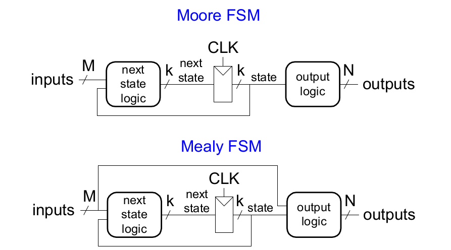
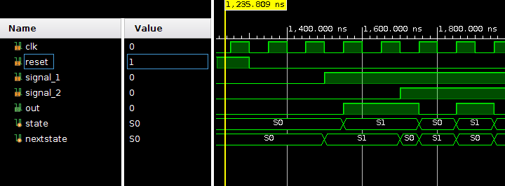

# Laboratory #5

In this laboratory you will get familiar with the following:

* Finite State Machines written in System Verilog:
  
  * Moore type
  
  * Mealy type

* Reusable code for bigger designs

* Nexys 4 DDR/ Nexys A7 development board and the: 
  
  * Seven digit display
  
  * RGB leds 

* Xilinx Vivado 2019.2

## Finite State Machines (FSM)

A useful formalism for designing more complex digital circuits is that of the finite state machine (FSM). Here, the circuit's function is broken down into a collection of states and rules which determine when the system moves from one state to another state. 

This concept can be committed to paper by drawing what is called a state diagram. The state diagram consists of nodes which represent the states and arrows (sometimes called edges) which give the possible transitions between states. The states usually are named something which indicates the function of that state. The state is held in flip flops, therefore there must be some mapping made between the states and their representation in the FFs. The arrows should be labeled with some condition which must be satisfied in order for that state transition to take place. Typically the transitions are taken in response to external stimuli. 

Finally the state machine must produce some desired configuration of outputs. State transitions and the output configuration are mediated by combinational logic acting on the inputs to the circuit and the circuit's internal state. 

Here is the pattern for designing with the FSM formalism:

1. Determine what states / transitions are needed in order to solve the problem.
2. Draw the state diagram, labeling the states and the edges.
3. Develop a mapping between state and representation in FFs.
4. Write out the state transition table.
5. Find the combinational logic which implements this state.

When designing FSM, there are two types:

* Moore Machine: outputs depend only on current state

* Mealy Machine: outputs depend on current state and inputs



In this laboratory we will implement both a Moore and Mealy FSM. 

## Moore FSM

A simple Moore FSM can be described with the following FSM diagram


In this diagram, two states are defined. The transition between each one can be achieved when it's respective signal is high and a clock transition happens. For example, when on state $S_0$ and $signal_1=1$, the new state will be $S_1$ after a clock transition. You can notice that $S_0$ has a double circle, this means that it will be our starting state when the reset is applied.

The code below shows how you would implement a module named `moore_fsm` that will accomplish this FSM.

```verilog
module moore_fsm(
    input logic clk,
    input logic reset,
    input logic signal_1, 
    input logic signal_2, 
    output logic out
    );

    typedef enum logic {S0, S1} statetype;
    statetype state, nexstate;


    // state register
    always_ff @(posedge clk, posedge reset)
        begin
            if (reset) state <= S0;
            else state <= nextstate;
        end


    // next state logic
    always_comb
        begin
            case (state)
                S0: if (signal_1) nextstate <= S1;
                    else   nextstate <= S0;

                S1: if (signal_2) nextstate <= S0;
                    else   nextstate <= S1;

                default: nextstate <= S0;
            endcase
        end


    // output logic
    assign out = state
endmodule
```

As you can see, we can divide a FSM in System Verilog into three parts:

* State register

* Next state logic

* Output logic

You can think of these parts as the blue prints to develop a FSM using System Verilog.

Below you can see the simulation results expected for this FSM, notice how the `nextstate` signal is set to the next state value when the activation signals are provided.


## Exercise #1

In this first exercise you will implement a Moore FSM as the one described in the following FSM diagram:


In here the FSM is described as follows:

* Four states $S$ are defined

* Each state will transition if its activation signal is on high, in other cases there won't be any transition.

* The initial reset state is $S_0$

Hardware designs are provided in:

 `/scr/sources/moore.sv` 

`/scr/sources/display.sv`

Simulations are provided in:

`/scr/sim/moore_tb.sv`.

Constraint files are provided in:

- If your development board is a Nexys4 use the `src/constrs/nexys4_moore.xdc`

- If your development board is a NexysA7 use the `src/constrs/nexysA7_moore.xdc`

The `display.sv` file is just an auxiliary file with a top module named `display` for you to interface with the 7 digit display.

First you will need to complete the `moore` module and simulate it with `moore_tb`. When you successfully complete the simulation, proceed to edit the `top_moore` module and generate a bitstream file with it and test it on your development board.

## Mealy FSM

A Mealy FSM is presented in the following image. As you can see, it is very similar to the one described in the Moore FSM, but now a `control` signal dictates the combinational output `y`.


The System Verilog implementation will be very similar to the one described before, the only difference will be in the `output logic` part.

The following code shows how the `output logic` should be written:

```verilog
// output logic
always_comb
    begin
        case (state)
                S0: y = 1'b0;

                S1: if(control) y = 1'b1;
                     else y = 1'b0;  

    end
```

## Exercise #2

Implement a Mealy FSM described by the following FSM diagram:


In this FSM, there are:

* Eight states $S$.

* Each state $S_n$ transitions to a state $S_{n+1}$ if its switch $sw_n$ is high, otherwise there's no transition.

* The output on each state $S_n$ is $y=n+1$ and $z=7-n$.

Hardware designs are provided in:

 `/scr/sources/mealy.sv` 

`/scr/sources/display.sv`

Simulations are provided in:

`/scr/sim/mealy_tb.sv`.

Constraint files are provided in:

- If your development board is a Nexys4 use the `src/constrs/nexys4_mealy.xdc`

- If your development board is a NexysA7 use the `src/constrs/nexysA7_mealy.xdc`

You will need to complete the `mealy` module and simulate it with `mealy_tb`. When you successfully complete the simulation, proceed to edit `top_mealy` module and instantiate the `clock_divider` module provided in `display.sv` with a `parameter` value of `25000000`,  then generate the bitstream file and test it on your development board.

## References:

* [Digital Electronics Part III : Finite State Machines](https://www.physics.wisc.edu/courses/home/fall2018/623/lecture_notes/digital/digital-03.html)

* [Finite State Machine Designer - by Evan Wallace](https://www.madebyevan.com/fsm/)
